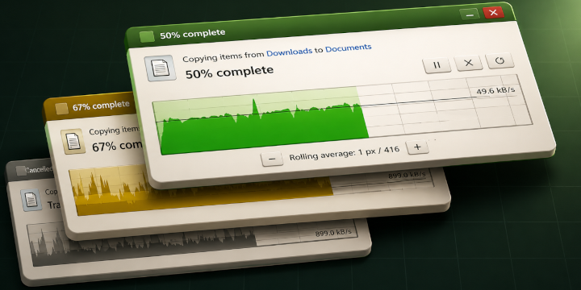
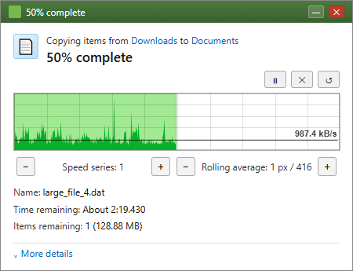
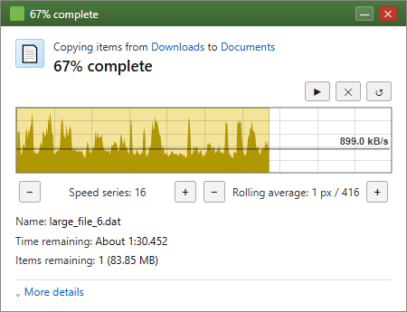
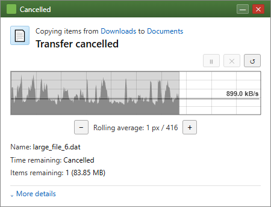

# Transfer Speed Graph



[NPM Package](npmjs.com/package/@arijs/transfer-speed-graph) 

A lightweight, modular transfer-speed graph inspired by the Windows 8 file transfer dialog, with support for:

- Real transfer integration (download/upload)
- Deterministic and random fake transfer simulation
- Pause/cancel/finish states
- Highly configurable graph smoothing and dynamic Y-scale behavior

### Real Example

[Live homepage](https://speed-transfer.arijs.org/)



## Quick Usage

### Download Example

```js
import { TransferGraph } from '@arijs/transfer-speed-graph'

const controller = new TransferGraph()
controller.setOnFrame((view) => {
  // update your UI with view.progressInt, view.speedBps, etc.
})

const downloadUrl = 'https://httpbin.org/bytes/12582912?seed=2026'
const fallbackTotalSize = 12 * 1024 * 1024

controller.setRendererOptions({
  canvasCtx,
  canvasWidth: 416,
  canvasHeight: 72,
})

fetch(downloadUrl).then(async (res) => {
  if (!res.ok || !res.body) throw new Error('Download failed: ' + res.status)

  const totalHeader = parseInt(res.headers.get('content-length') || '0', 10)
  const totalSize = Number.isFinite(totalHeader) && totalHeader > 0
    ? totalHeader
    : fallbackTotalSize

  const reader = res.body.getReader()
  let transferredBytes = 0

  controller.startTransfer({ totalSize })

  while (true) {
    const chunk = await reader.read()
    if (chunk.done) break
    transferredBytes += chunk.value.byteLength
    controller.pushProgress({ transferredBytes, totalSize })
  }

  controller.finishTransfer({ transferredBytes, totalSize })
}).catch((err) => {
  console.warn(err)
  controller.cancel()
})
```

Source example: [real/download-example.js](real/download-example.js)

### Upload Example

```js
import { TransferGraph } from '@arijs/transfer-speed-graph'

const controller = new TransferGraph()
const uploadUrl = 'https://httpbin.org/post'
const uploadSize = 10 * 1024 * 1024

const xhr = new XMLHttpRequest()
const payload = new Blob([new Uint8Array(uploadSize)])

controller.setRendererOptions({
  canvasCtx,
  canvasWidth: 416,
  canvasHeight: 72,
})
controller.startTransfer({ totalSize: uploadSize })

xhr.upload.addEventListener('progress', (ev) => {
  if (!ev.lengthComputable) return
  controller.pushProgress({
    transferredBytes: ev.loaded,
    totalSize: ev.total,
  })
})

xhr.addEventListener('load', () => {
  controller.finishTransfer({
    transferredBytes: uploadSize,
    totalSize: uploadSize,
  })
})

xhr.addEventListener('error', () => {
  console.warn('upload failed')
  controller.cancel()
})

xhr.addEventListener('abort', () => {
  controller.cancel()
})

xhr.open('POST', uploadUrl)
xhr.send(payload)
```

Source example: [real/upload-example.js](real/upload-example.js)

## State Showcase

Paused state:



Cancelled state:



## Why This Library Is Strong

### Source Files

The published package is split by concern:

- Graph core:
  - [core/main.js](core/main.js)
    public `TransferGraph` facade that coordinates model, renderer, and runtime APIs.
  - [core/model.js](core/model.js)
    transfer state machine plus series, timing, and control state management.
  - [core/renderer.js](core/renderer.js)
    renderer configuration layer that resolves options and delegates frame drawing.
  - [core/frame.js](core/frame.js)
    canvas frame rendering, graph geometry, and draw-hook execution.
  - [core/speed-series.js](core/speed-series.js)
    series utilities for averaging, speed calculations, and coordinate transforms.
- Fake transfer subsystem:
  - [fake/progress-source.js](fake/progress-source.js)
    controller bridge that drives fake progress updates into the graph.
  - [fake/simulation.js](fake/simulation.js)
    deterministic/random simulation engine for timing and size progression.
  - [fake/series.js](fake/series.js)
    fake-series helpers and presets used by the simulator.
- Real transfer examples:
  - [real/download-example.js](real/download-example.js)
    streaming download example wired to the graph controller.
  - [real/upload-example.js](real/upload-example.js)
    upload progress example wired to the graph controller.

That separation keeps rendering, state management, fake generation, and transport examples independent and easy to evolve.

### High Configurability

Graph behavior can be tuned at runtime with controls such as:

- `pixelAverageWindow`
- `maxSpeedDecay`
- `maxSpeedHeadroom`
- `ignoreTrailingSpeedSample`

Fake simulation is configurable through `simulationOptions`, including:

- `minFrame`, `maxFrame`
- `minFrameRepeat`, `maxFrameRepeat`
- `minSizeInc`, `maxSizeInc`
- `deterministicSeed`

This allows both realistic noisy profiles and stable deterministic test profiles.

### Canvas Drawing Hooks

The renderer also exposes optional hooks for custom canvas drawing. If you do not provide any of them, the default implementation keeps the current visual behavior.

Pass these through `new TransferGraph({ ... })` or `controller.setRendererOptions({ ... })`:

#### Common argument properties

Every draw hook receives these shared properties:

- `canvasCtx`: the active 2D canvas context for the current frame.
- `canvasWidth`: the canvas width in pixels.
- `canvasHeight`: the canvas height in pixels.

#### `drawProgressBar`

Signature:

```js
drawProgressBar({ canvasCtx, canvasWidth, canvasHeight, lastX, backgroundValue, createDefaultPath })
```

- `lastX`: the resolved filled width of the progress bar in canvas coordinates.
- `backgroundValue`: the value used to compute the background fill width.
- `createDefaultPath()`: builds the current progress-bar path with `beginPath()` + `rect()`.

Default behavior: the renderer calls `createDefaultPath()`, then `fill()` and `stroke()`.

```js
const graph = new TransferGraph({
  drawProgressBar({ canvasCtx, createDefaultPath }) {
    createDefaultPath()
    canvasCtx.fill()
    canvasCtx.stroke()
  },
})
```

#### `drawGrid`

Signature:

```js
drawGrid({ canvasCtx, canvasWidth, canvasHeight, gridCols, gridRows, createDefaultPath })
```

- `gridCols`: number of vertical grid divisions.
- `gridRows`: number of horizontal grid divisions.
- `createDefaultPath()`: builds the current grid paths for both directions.

Default behavior: the renderer calls `createDefaultPath()`, then `stroke()`.

```js
const graph = new TransferGraph({
  drawGrid({ canvasCtx, createDefaultPath }) {
    createDefaultPath()
    canvasCtx.stroke()
  },
})
```

#### `drawSpeedOverlay`

Signature:

```js
drawSpeedOverlay({ canvasCtx, canvasWidth, canvasHeight, lastX, endX, avgWithSpeeds, renderPointCount, pixelsPerValue, maxAvgSpeed, createDefaultPath })
```

- `lastX`: the resolved filled width of the progress area.
- `endX`: the right edge where the overlay path should continue until the filled progress ends.
- `avgWithSpeeds`: the calculated speed points used to draw the overlay.
- `renderPointCount`: number of points used when rendering the visible speed curve.
- `pixelsPerValue`: the conversion factor from value units to canvas X pixels.
- `maxAvgSpeed`: the resolved speed scale used to normalize the overlay height.
- `createDefaultPath()`: builds the current speed-area path and returns the resolved point position via the internal path logic.

Default behavior: the renderer calls `createDefaultPath()`, then `fill()`.

```js
const graph = new TransferGraph({
  drawSpeedOverlay({ canvasCtx, createDefaultPath }) {
    createDefaultPath()
    canvasCtx.fill()
  },
})
```

#### `drawSpeedLineLabel`

Signature:

```js
drawSpeedLineLabel({ canvasCtx, canvasWidth, canvasHeight, guideY, textX, labelBottomY, labelTopY, labelLeftX, labelWidth, labelPaddingX, labelPaddingY, speedLabel, speedLabelColor, speedLabelBackgroundColor, speedGuideColor, createDefaultLinePath, createDefaultLabelBackgroundPath, fillDefaultLabelText })
```

- `guideY`: the Y position of the horizontal guide line.
- `textX`: the right-aligned X position used for the label text.
- `labelBottomY`: the baseline Y position for the label text.
- `labelTopY`: the top Y position of the background box.
- `labelLeftX`: the left X position of the background box.
- `labelWidth`: measured width of the label text.
- `labelPaddingX`: horizontal padding used by the default label box.
- `labelPaddingY`: vertical padding used by the default label box.
- `speedLabel`: the formatted label string.
- `speedLabelColor`: the current text color.
- `speedLabelBackgroundColor`: the current background fill color.
- `speedGuideColor`: the current guide-line stroke color.
- `createDefaultLinePath()`: builds the current guide-line path.
- `createDefaultLabelBackgroundPath()`: builds the current label background path with `beginPath()` + `rect()`.
- `fillDefaultLabelText(options)`: draws the current text using `fillText()`. You can override the fill style or text alignment through `options`.

Default behavior: the renderer calls the default line path, strokes it, calls the default background path, fills it, and then calls `fillDefaultLabelText()`.

```js
const graph = new TransferGraph({
  drawSpeedLineLabel({
    canvasCtx,
    createDefaultLinePath,
    createDefaultLabelBackgroundPath,
    fillDefaultLabelText,
  }) {
    createDefaultLinePath()
    canvasCtx.stroke()
    createDefaultLabelBackgroundPath()
    canvasCtx.fill()
    fillDefaultLabelText()
  },
})
```

#### `drawBorder`

Signature:

```js
drawBorder({ canvasCtx, canvasWidth, canvasHeight, borderColor, createDefaultPath })
```

- `borderColor`: the current border stroke color.
- `createDefaultPath()`: builds the current canvas border path with `beginPath()` + `rect()`.

Default behavior: the renderer calls `createDefaultPath()`, then `stroke()`.

```js
const graph = new TransferGraph({
  drawBorder({ canvasCtx, createDefaultPath }) {
    createDefaultPath()
    canvasCtx.stroke()
  },
})
```

### Practical Runtime API

`TransferGraph` gives a straightforward app-facing API:

#### `startTransfer`

Start a new transfer and reset the runtime state.

Signature:

```js
startTransfer(config)
```

- `config.totalSize`: required positive total size for the transfer.
- `config.nowMs`: optional timestamp used as the transfer start time.

Example:

```js
const graph = new TransferGraph()
graph.startTransfer({ totalSize: 12 * 1024 * 1024 })
```

#### `pushProgress`

Append a new progress update to the active transfer.

Signature:

```js
pushProgress(update)
```

- `update.transferredBytes`: current transferred byte count.
- `update.totalSize`: optional total size override.
- `update.elapsedMs`: optional elapsed time override.
- `update.nowMs`: optional timestamp used to resolve elapsed time.

Example:

```js
const graph = new TransferGraph()
graph.pushProgress({ transferredBytes: 4 * 1024 * 1024 })
```

#### `finishTransfer`

Mark the transfer as finished and capture the final point.

Signature:

```js
finishTransfer(update)
```

- `update.transferredBytes`: final transferred byte count.
- `update.totalSize`: optional total size override.
- `update.elapsedMs`: optional elapsed time override.
- `update.nowMs`: optional timestamp used to resolve elapsed time.

Example:

```js
const graph = new TransferGraph()
graph.finishTransfer({ transferredBytes: 12 * 1024 * 1024 })
```

#### `cancel`

Cancel the active transfer and freeze it in a finished state.

Signature:

```js
cancel()
```

Example:

```js
const graph = new TransferGraph()
graph.cancel()
```

#### `reset`

Reset the model back to its initial state.

Signature:

```js
reset()
```

Example:

```js
const graph = new TransferGraph()
graph.reset()
```

#### `pause`

Pause elapsed-time tracking without clearing transfer progress.

Signature:

```js
pause(nowMs)
```

- `nowMs`: optional timestamp used to freeze elapsed-time calculations.

Example:

```js
const graph = new TransferGraph()
graph.pause()
```

#### `resume`

Resume elapsed-time tracking after a pause.

Signature:

```js
resume(nowMs)
```

- `nowMs`: optional timestamp used to resume elapsed-time calculations.

Example:

```js
const graph = new TransferGraph()
graph.resume()
```

#### `toggleFinishedPauseVisual`

Toggle the paused visual state that is shown after a transfer finishes.

Signature:

```js
toggleFinishedPauseVisual()
```

Example:

```js
const graph = new TransferGraph()
graph.toggleFinishedPauseVisual()
```

#### `refreshGraphScale`

Force the renderer to recalculate the speed scale on the next frame.

Signature:

```js
refreshGraphScale()
```

Example:

```js
const graph = new TransferGraph()
graph.refreshGraphScale()
```

#### `setPixelAverageWindow`

Change the rolling average window used by the renderer.

Signature:

```js
setPixelAverageWindow(nextWindow)
```

- `nextWindow`: smoothing window size in rendered points.

Example:

```js
const graph = new TransferGraph()
graph.setPixelAverageWindow(16)
```

#### `setMaxSpeedDecay`

Change the decay factor used for the dynamic speed scale.

Signature:

```js
setMaxSpeedDecay(nextValue)
```

- `nextValue`: new decay value, typically between `0.5` and `0.999`.

Example:

```js
const graph = new TransferGraph()
graph.setMaxSpeedDecay(0.95)
```

#### `setMaxSpeedHeadroom`

Change the headroom factor used for the dynamic speed scale.

Signature:

```js
setMaxSpeedHeadroom(nextValue)
```

- `nextValue`: new headroom value, typically between `1` and `2`.

Example:

```js
const graph = new TransferGraph()
graph.setMaxSpeedHeadroom(1.08)
```

#### `setOnFrame`

Register a callback that receives the computed frame view model.

Signature:

```js
setOnFrame(onFrame)
```

- `onFrame(view)`: receives the computed frame view model.

Example:

```js
const graph = new TransferGraph()
graph.setOnFrame((view) => {
  console.log(view.progressInt)
})
```

#### `setOnControls`

Register a callback that receives the current controls state.

Signature:

```js
setOnControls(onControls)
```

- `onControls(view)`: receives the current controls state.

Example:

```js
const graph = new TransferGraph()
graph.setOnControls((controls) => {
  console.log(controls.pixelAverageWindow)
})
```

#### `setOnStateChange`

Register a callback that receives the raw state snapshot.

Signature:

```js
setOnStateChange(onStateChange)
```

- `onStateChange(state)`: receives the raw state snapshot.

Example:

```js
const graph = new TransferGraph()
graph.setOnStateChange((state) => {
  console.log(state.started, state.finished)
})
```

#### `drawProgressBar`

Customize the progress-bar canvas path and paint behavior.

Signature:

```js
drawProgressBar(drawArgs)
```

- `drawArgs`: the draw-specific argument object described above in the Canvas Drawing Hooks section.

Example:

```js
const graph = new TransferGraph({
  drawProgressBar({ canvasCtx, createDefaultPath }) {
    createDefaultPath()
    canvasCtx.fill()
    canvasCtx.stroke()
  },
})
```

#### `drawGrid`

Customize the grid canvas path and stroke behavior.

Signature:

```js
drawGrid(drawArgs)
```

- `drawArgs`: the draw-specific argument object described above in the Canvas Drawing Hooks section.

Example:

```js
const graph = new TransferGraph({
  drawGrid({ canvasCtx, createDefaultPath }) {
    createDefaultPath()
    canvasCtx.stroke()
  },
})
```

#### `drawSpeedOverlay`

Customize the speed overlay canvas path and fill behavior.

Signature:

```js
drawSpeedOverlay(drawArgs)
```

- `drawArgs`: the draw-specific argument object described above in the Canvas Drawing Hooks section.

Example:

```js
const graph = new TransferGraph({
  drawSpeedOverlay({ canvasCtx, createDefaultPath }) {
    createDefaultPath()
    canvasCtx.fill()
  },
})
```

#### `drawSpeedLineLabel`

Customize the guide line, label background, and label text paint.

Signature:

```js
drawSpeedLineLabel(drawArgs)
```

- `drawArgs`: the draw-specific argument object described above in the Canvas Drawing Hooks section.

Example:

```js
const graph = new TransferGraph({
  drawSpeedLineLabel({
    canvasCtx,
    createDefaultLinePath,
    createDefaultLabelBackgroundPath,
    fillDefaultLabelText,
  }) {
    createDefaultLinePath()
    canvasCtx.stroke()
    createDefaultLabelBackgroundPath()
    canvasCtx.fill()
    fillDefaultLabelText()
  },
})
```

#### `drawBorder`

Customize the canvas border path and stroke behavior.

Signature:

```js
drawBorder(drawArgs)
```

- `drawArgs`: the draw-specific argument object described above in the Canvas Drawing Hooks section.

Example:

```js
const graph = new TransferGraph({
  drawBorder({ canvasCtx, createDefaultPath }) {
    createDefaultPath()
    canvasCtx.stroke()
  },
})
```

## Development

Install dependencies:

```bash
npm install
```

Run tests / snapshot checks:

```bash
npm test
```

Open the demo UI by loading [index.html](index.html) in a browser.
